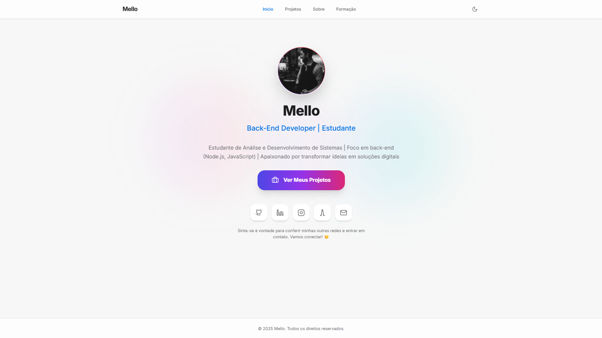
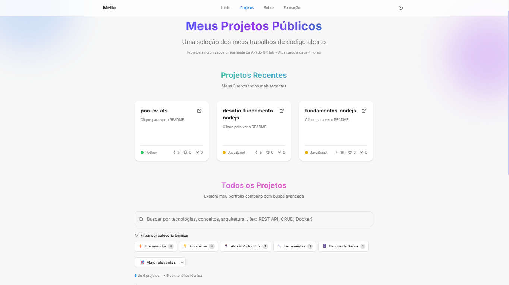
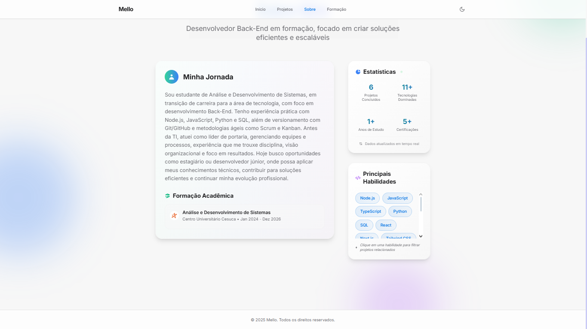
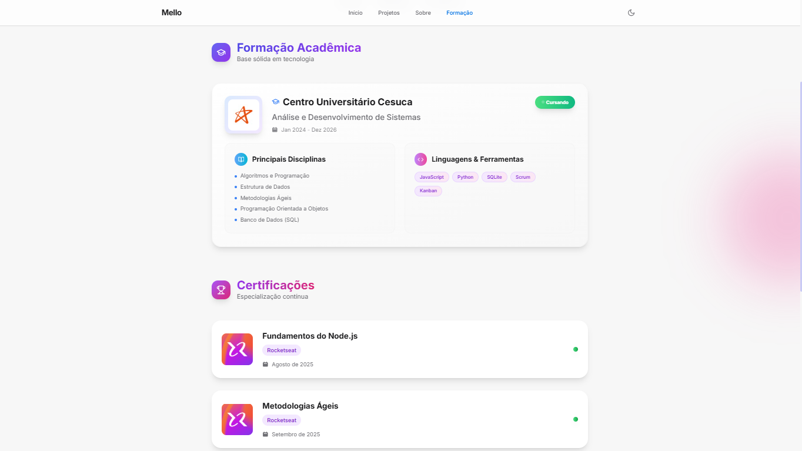

# Personal Portfolio Template

Um template moderno e responsivo para portfólio de desenvolvedores, construído com React, TypeScript e Tailwind CSS. Totalmente configurável através de um único arquivo JSON.

## Demonstração



## Páginas Incluídas

| Página                   | Screenshot                                         | Descrição                                     |
| ------------------------- | -------------------------------------------------- | ----------------------------------------------- |
| **Home**            |                       | Landing page com apresentação pessoal e CTA   |
| **Projetos**        |                | Lista de projetos do GitHub com busca avançada |
| **Sobre**           |                     | Informações pessoais, skills e estatísticas  |
| **Certificações** |  | Formações acadêmicas e certificações       |

## Características

### Tecnologia

- **React 19** com TypeScript
- **Tailwind CSS** para estilização
- **Vite** para build e desenvolvimento
- **Integração GitHub API** com cache inteligente
- **Responsivo** e otimizado para performance

### Funcionalidades

- **Busca Avançada de Projetos** - 130+ palavras-chave técnicas
- **Sistema de Cache** - Evita rate limits da API do GitHub
- **Modo Escuro/Claro** - Alternância automática
- **Animações Simples** - Transições suaves e microinterações
- **SEO Basico Otimizado** - Meta tags e estrutura semântica
- **PWA Ready** - Preparado para Progressive Web App

### Design

- **Layout Moderno** - Gradientes, glassmorphism e sombras
- **Tipografia Responsiva** - Adaptável a qualquer dispositivo
- **Componentes Reutilizáveis** - Arquitetura escalável
- **Temas Personalizáveis** - Cores e animações configuráveis

## Configuração Rápida

### 1. Clone o Repositório

```bash
git clone https://github.com/seu-usuario/personal-portfolio.git
cd personal-portfolio
```

### 2. Instale as Dependências

```bash
npm install
```

### 3. Configure suas Informações

Edite apenas o arquivo `portfolio-config.json` com seus dados:

```json
{
  "informacoesPessoais": {
    "nome": "Seu Nome",
    "titulo": "Sua Profissão | Especialização",
    "biografiaCompleta": "Sua biografia...",
    "email": "seu-email@exemplo.com"
  },
  "github": {
    "usuario": "seu-username-github"
  },
  "redesSociais": {
    "linkedin": "https://linkedin.com/in/seu-perfil",
    "instagram": "https://instagram.com/seu-perfil"
  }
}
```

### 4. Inicie o Servidor de Desenvolvimento

```bash
npm run dev
```

Acesse http://localhost:5173 para ver seu portfólio!

## Configuração Avançada

### Token GitHub (Opcional, porem Recomendado)

Para evitar rate limits da API do GitHub (Muito baixo a depender do seu uso), configure um token:

#### Como Obter o Token:

1. Acesse [GitHub Settings → Personal Access Tokens](https://github.com/settings/tokens)
2. Clique em "Generate new token (classic)"
3. Adicione uma descrição (ex: "Portfolio Token")
4. **Não selecione nenhum escopo** (token público é suficiente)
5. Clique em "Generate token"
6. Copie o token gerado

#### Configuração:

1. Copie `.env.exemple` para `.env.local`
2. Adicione seu token:

```bash
GITHUB_TOKEN=seu_token_aqui
```

### Personalização Completa

O arquivo `portfolio-config.json` permite customizar:

#### Informações Pessoais

```json
{
  "informacoesPessoais": {
    "nome": "Seu Nome Completo",
    "titulo": "Sua Posição | Especialização",
    "biografiaCompleta": "Descrição detalhada sobre você...",
    "email": "contato@exemplo.com"
  }
}
```

#### Configuração do GitHub

```json
{
  "github": {
    "usuario": "seu-username",
    "projetosDestacados": ["repo1", "repo2"],
    "repositoriosIgnorados": ["docs", "config"],
    "mostrarEstatisticas": true,
    "quantidadeProjetosRecentes": 3
  }
}
```

#### Redes Sociais

```json
{
  "redesSociais": {
    "github": "https://github.com/usuario",
    "linkedin": "https://linkedin.com/in/usuario",
    "twitter": "https://twitter.com/usuario",
    "instagram": "https://instagram.com/usuario",
    "website": "https://seusite.com"
  }
}
```

#### Skills Técnicas

```json
{
  "habilidades": {
    "linguagens": ["JavaScript", "TypeScript", "Python"],
    "frontend": ["React", "Next.js", "Tailwind CSS"],
    "ferramentas": ["Git", "Docker", "AWS"]
  }
}
```

#### Formação Acadêmica

```json
{
  "formacaoAcademica": {
    "formacoes": [
      {
        "instituicao": "Nome da Universidade",
        "curso": "Nome do Curso",
        "periodo": "Jan 2020 - Dez 2024",
        "logoUrl": "https://url-do-logo.com/logo.png",
        "status": "Concluído", // ou "Em andamento"
        "disciplinasPrincipais": [
          "Algoritmos e Programação",
          "Estrutura de Dados"
        ],
        "tecnologias": ["JavaScript", "Python", "SQL"]
      }
    ]
  }
}
```

#### Certificações

```json
{
  "certificacoes": {
    "certificados": [
      {
        "titulo": "Nome da Certificação",
        "emissor": "Empresa/Instituição",
        "logoEmisor": "https://url-do-logo.com/logo.png",
        "data": "Mês de Ano",
        "urlVerificacao": "https://url-certificado.com"
      }
    ]
  }
}
```

## Deploy na Vercel

### Opção 1: Deploy Automático

[](https://vercel.com/new/clone?repository-url=https://github.com/seu-usuario/personal-portfolio)

### Opção 2: Deploy Manual

#### 1. Prepare o Projeto

```bash
# Build para produção
npm run build

# Teste o build localmente (opcional)
npm run preview
```

#### 2. Deploy na Vercel

```bash
# Instale a CLI da Vercel
npm install -g vercel

# Faça login
vercel login

# Deploy do projeto
vercel

# Para production
vercel --prod
```

#### 3. Configuração de Ambiente

Se estiver usando token do GitHub, configure na Vercel:

1. Acesse o painel da Vercel
2. Vá em Settings → Environment Variables
3. Adicione: `GITHUB_TOKEN` com o valor do seu token

#### 4. Domínio Customizado (Opcional)

1. No painel da Vercel, vá em Domains
2. Adicione seu domínio personalizado
3. Configure os DNS conforme as instruções

## Scripts Disponíveis

```bash
npm run dev      # Servidor de desenvolvimento
npm run build    # Build para produção
npm run preview  # Preview do build de produção
```

## Estrutura do Projeto

```
personal-portfolio/
├── components/           # Componentes React
├── services/            # Integrações API
├── screenshots/         # Capturas de tela
├── portfolio-config.json # Configuração principal
├── config-loader.ts     # Carregador de configurações
├── constants.ts         # Constantes do projeto
├── types.ts            # Tipos TypeScript
├── App.tsx             # Componente principal
└── index.html          # Template HTML
```

## Solução de Problemas

### Rate Limit do GitHub

**Problema:** Muitas requisições à API do GitHub
**Solução:** Configure um token do GitHub no `.env.local`

### Build Error

**Problema:** Erro durante o build
**Solução:** Verifique se todas as URLs no `portfolio-config.json` são válidas

### Layout Quebrado

**Problema:** Textos saindo dos containers
**Solução:** O template já inclui quebra de linha automática e scroll para conteúdo extenso

## Contribuição

Contribuições são bem-vindas! Por favor:

1. Fork o projeto
2. Crie uma branch para sua feature (`git checkout -b feature/nova-feature`)
3. Commit suas mudanças (`git commit -m 'Adiciona nova feature'`)
4. Push para a branch (`git push origin feature/nova-feature`)
5. Abra um Pull Request

## Licença

Este projeto está sob a licença MIT. Veja o arquivo [LICENSE](LICENSE) para mais detalhes.

## Autor

**Seu Nome**

- GitHub: [@melloxyz](https://github.com/melloxyz)
- LinkedIn: [mellodev-](https://linkedin.com/in/mellodev-)
- Email: joaovdmello@gmail.com

---

**Feito com React + TypeScript + Tailwind CSS**
